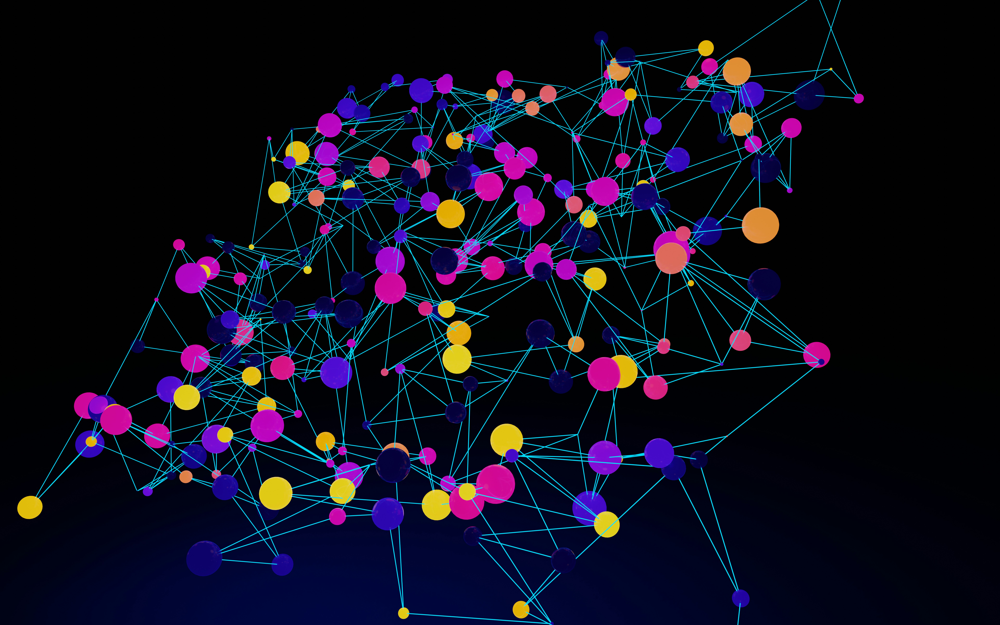
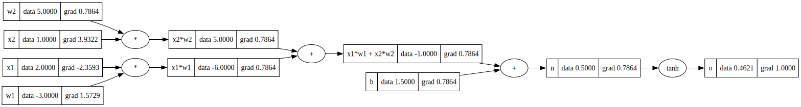

# Micrograd

A scalar-valued autograd engine built from scratch in Python, following 
Karpathy's micrograd. Implements backpropagation over a dynamical computational 
graph with a small neural network library on top.

## Structure
- `engine.py` — Value class with full operator overloading and backward pass
- `nn.py` — Neuron, Layer, and MLP built on top of the Value class
- `test.py` — verifies micrograd gradients match PyTorch exactly

## What it implements
- Forward and backward pass for all basic operations (+, *, **, tanh, exp)
- Topological sort for correct gradient accumulation order
- Automatic handling of variables used multiple times in the graph
- A working MLP trained with gradient descent

## Computational Graph
Visualization of a sample forward pass showing how the Value class 
builds the computation graph automatically:

The full MLP graph is significantly larger — each arrow represents 
a Value node that tracks its own gradient during backpropagation.

## Training loss
Loss decreasing over 10 iterations confirming gradient descent is working:

| Iteration | Loss |
|-----------|------|
| 0 | 4.1426 |
| 1 | 4.0570 |
| 2 | 3.9571 |
| 3 | 3.8400 |
| 4 | 3.7025 |
| 5 | 3.5408 |
| 6 | 3.3513 |
| 7 | 3.1315 |
| 8 | 2.8809 |
| 9 | 2.6040 |

## Verified against PyTorch
Running `python test.py` confirms all gradients match PyTorch to 1e-6 precision.

## Reference
- [Karpathy's micrograd](https://github.com/karpathy/micrograd)
- [Video walkthrough](https://www.youtube.com/watch?v=VMj-3S1tku0)
